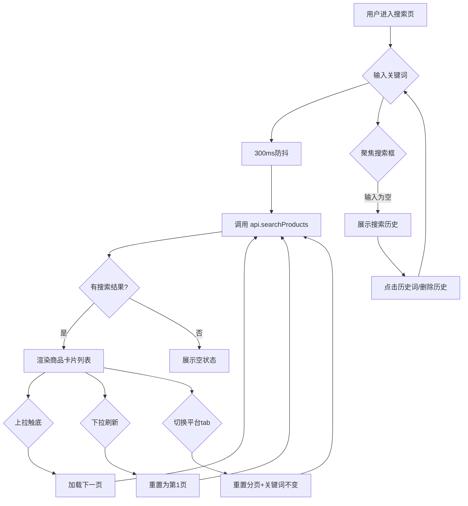

## 产品概述

为多平台CPS返利小程序「boboshop」创建商品搜索列表页，作为项目首个业务页面。支持用户搜索商品关键词、切换电商平台、浏览商品列表，为后续的商品详情和下单返利流程奠定基础。

## 核心功能

- **搜索框**：顶部搜索输入框，支持输入关键词、一键清空、回车触发搜索；聚焦时展示最近搜索历史（最多10条），支持点击历史词快速搜索和逐条删除
- **搜索历史**：自动记录最近搜索关键词，本地持久化存储，支持清空全部历史
- **平台筛选Tab**：横向可滚动的平台切换标签（全部/淘宝/京东/拼多多/抖音），切换后自动以当前关键词重新搜索
- **商品卡片列表**：每张卡片展示商品主图、标题（最多2行省略）、券后价、返利金额、平台标签（带品牌色），点击跳转商品详情（预留）
- **下拉刷新 + 上拉加载**：下拉刷新当前搜索结果，上拉触底加载下一页数据，加载完毕显示提示

## 技术栈

- **框架**：微信原生小程序（Skyline 渲染引擎 + glass-easel 组件框架）
- **页面模式**：Component 模式（与现有 index/logs 页一致）
- **导航栏**：复用现有 `/components/navigation-bar/navigation-bar`
- **数据持久化**：`wx.Storage`（搜索历史）
- **API 层**：`utils/api.js`（CommonJS 模块，当前返回 mock 数据）

## 实现方案

### 整体策略

新建 `pages/search/` 页面目录，包含标准的四文件结构（js/wxml/wxss/json）。创建 `utils/api.js` 作为 API 层，封装统一的搜索接口（当前使用 mock 数据，返回结构与真实接口一致）。修改 `app.json` 注册新页面。搜索历史通过 `wx.getStorageSync` / `wx.setStorageSync` 本地管理。

### 关键设计决策

**Mock 数据设计**：API 层 `utils/api.js` 导出 `searchProducts({ keyword, platform, page, pageSize })` 函数，内部生成模拟商品数据。商品数据结构与真实接口对齐：

```js
{
  id: string,         // 商品ID
  title: string,      // 商品标题
  image: string,      // 主图URL
  price: number,      // 券后价
  originalPrice: number, // 原价
  rebate: number,     // 返利金额
  platform: string,   // 'taobao' | 'jd' | 'pdd' | 'douyin'
  sales: number,      // 销量
  couponAmount: number, // 优惠券面额
}
```

**搜索防抖**：输入时 300ms 防抖，避免频繁触发搜索。

**分页状态管理**：`page`、`pageSize`、`hasMore`、`total` 四个字段控制分页，避免重复请求。

**平台切换**：切换平台 tab 时重置分页为第1页，使用当前关键词重新请求。

### 性能优化

- 商品图片使用 `lazy-load` 属性延迟加载
- 列表使用 `wx:key="id"` 提升渲染性能
- 搜索输入 300ms 防抖，减少无效请求
- 搜索历史最多保留 10 条，避免存储膨胀
- 分页每次加载 20 条，控制单次数据量

### 爆炸半径控制

- 仅新增 `pages/search/` 目录和 `utils/api.js`，不修改任何现有页面逻辑
- `app.json` 仅追加页面注册，不影响现有路由
- mock 数据与真实接口结构一致，后续切换仅需修改 `utils/api.js` 中函数实现

## 架构设计



## 目录结构

```
boboshop/
├── app.json                          # [MODIFY] 追加 pages/search/search 到 pages 数组
├── pages/
│   └── search/
│       ├── search.js                 # [NEW] 搜索页核心逻辑（Component模式）
│       │   - 搜索输入防抖、状态管理（keyword/platform/page/hasMore/list）
│       │   - 搜索历史读写（Storage）、历史词点击/删除/清空
│       │   - 平台tab切换逻辑、下拉刷新、上拉加载
│       │   - 调用 utils/api.js 的 searchProducts
│       ├── search.wxml               # [NEW] 搜索页模板
│       │   - navigation-bar 组件
│       │   - 搜索框区域（input + 清空/搜索按钮）
│       │   - 搜索历史面板（条件渲染，wx:for 列表）
│       │   - 平台筛选tab（scroll-view 横向）
│       │   - 商品列表（scroll-view + refresher-enabled 下拉刷新）
│       │   - 商品卡片组件（主图/标题/价格/返利/平台标签）
│       │   - 加载更多提示 / 空状态 / 无结果状态
│       ├── search.wxss               # [NEW] 搜索页样式
│       │   - 搜索框区域样式（含聚焦态/历史面板定位）
│       │   - 平台tab样式（选中态下划线+品牌色）
│       │   - 商品卡片样式（2列网格布局）
│       │   - 价格/返利金额高亮、平台标签品牌色
│       │   - 加载/空状态样式
│       └── search.json               # [NEW] 搜索页配置
│           - usingComponents 引用 navigation-bar
└── utils/
    └── api.js                        # [NEW] API 层（CommonJS 模块）
        - searchProducts({ keyword, platform, page, pageSize }) 模拟搜索
        - 内置 mock 商品数据生成逻辑，返回结构与真实接口一致
        - 模拟网络延迟 300-800ms，返回 Promise
```

## 关键代码结构

### API 接口契约

```js
// utils/api.js - 搜索接口
// 入参
interface SearchParams {
  keyword: string;    // 搜索关键词（空字符串 = 全量）
  platform: string;   // 'all' | 'taobao' | 'jd' | 'pdd' | 'douyin'
  page: number;       // 页码，从1开始
  pageSize: number;   // 每页条数，默认20
}

// 返回
interface SearchResult {
  code: number;       // 0=成功
  data: {
    list: Product[];  // 商品列表
    total: number;    // 总数
    hasMore: boolean; // 是否还有更多
  }
}

interface Product {
  id: string;
  title: string;
  image: string;
  price: number;       // 券后价
  originalPrice: number;
  rebate: number;      // 返利金额
  platform: 'taobao' | 'jd' | 'pdd' | 'douyin';
  sales: number;
  couponAmount: number;
}
```

### 页面 data 结构

```js
// pages/search/search.js - data
{
  keyword: '',           // 当前搜索关键词
  platform: 'all',       // 当前平台筛选
  platforms: [           // 平台列表（含品牌色）
    { key: 'all', name: '全部', color: '' },
    { key: 'taobao', name: '淘宝', color: '#ff5000' },
    { key: 'jd', name: '京东', color: '#c91623' },
    { key: 'pdd', name: '拼多多', color: '#e02e24' },
    { key: 'douyin', name: '抖音', color: '#000000' }
  ],
  productList: [],       // 商品列表
  page: 1,
  pageSize: 20,
  hasMore: true,
  loading: false,        // 加载中
  refreshing: false,     // 下拉刷新中
  searchHistory: [],     // 搜索历史
  showHistory: false,    // 是否展示搜索历史面板
  empty: false,          // 是否空结果
}
```

## 设计风格

采用清爽的电商搜索风格，白色背景搭配品牌色点缀。整体布局简洁高效，突出商品信息，减少视觉干扰。

## 页面布局（自上而下）

### 1. 顶部导航栏

复用现有 navigation-bar 组件，标题设为「商品搜索」，白色背景黑色文字，不带返回按钮。

### 2. 搜索栏区域

白色背景，包含圆角搜索框（浅灰底色 #f5f5f5，圆角 40rpx）、左侧搜索图标、输入文字、右侧清空按钮。搜索框右侧放置橙色「搜索」文字按钮。聚焦时搜索框边框高亮为橙色。

### 3. 搜索历史面板

搜索框聚焦且输入为空时，在搜索栏下方弹出白色面板。标题「搜索历史」+ 右侧「清空」按钮。历史词以灰色标签形式横向排列（浅灰底色，小圆角），每个标签可点击搜索，长按或右侧可删除。

### 4. 平台筛选Tab

一行横向滚动的 tab 栏，包含「全部」「淘宝」「京东」「拼多多」「抖音」。选中 tab 文字加粗并显示对应平台品牌色下划线（淘宝 #ff5000、京东 #c91623、拼多多 #e02e24、抖音 #000000），未选中为灰色文字。# 6. 商品卡片
双列网格布局，每个卡片白色背景+圆角8rpx+浅阴影。卡片内依次放置：商品主图（宽高比1:1，圆角顶部）、标题（两行省略，14号字体）、券后价（大号橙色加粗）+ 原价（小号灰色删除线）、返利金额（红色标签「返¥XX.XX」）、平台标签（右上角小标签，品牌色底白字）。

### 5. 下拉刷新 & 上拉加载

下拉时顶部出现微信原生刷新动画。上拉触底时底部显示「加载中...」或「没有更多了」。

### 6. 空状态 / 无结果

搜索无结果时，居中展示空状态插图 + 提示文字「暂无相关商品，试试其他关键词吧」。